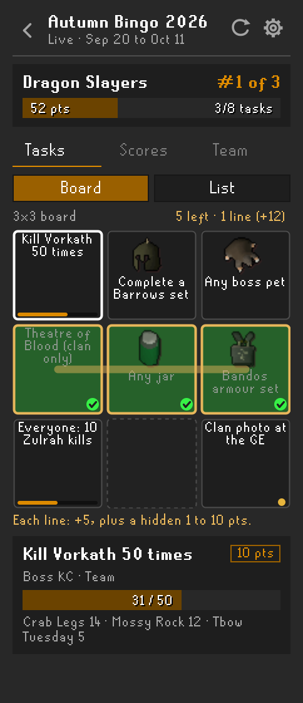
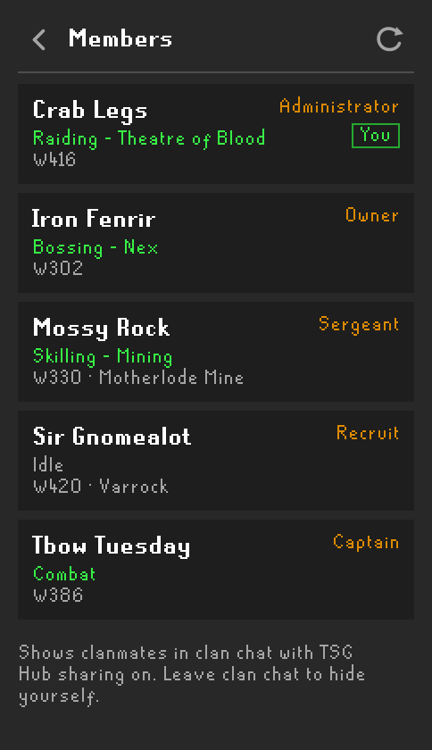
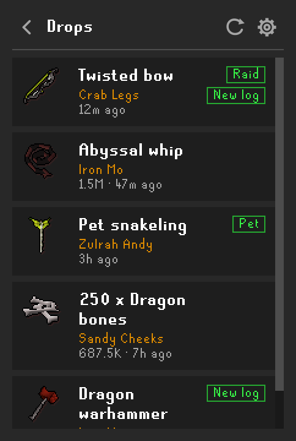
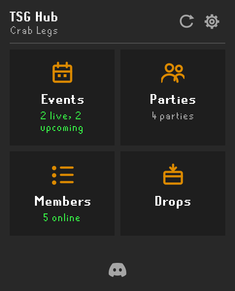
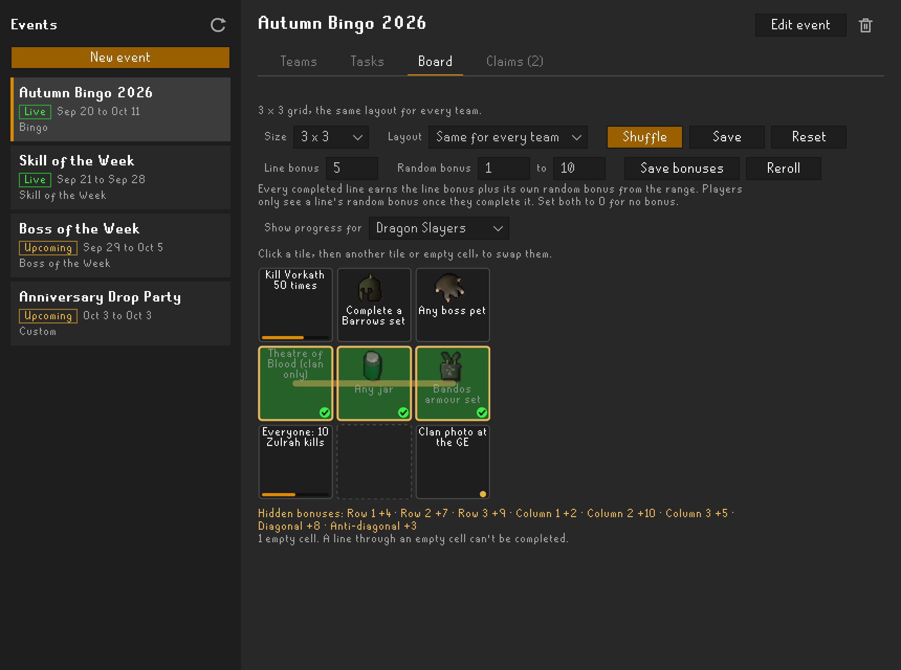

# TSG Hub

Clan events for **Type Shiii Gaming** (TSG), right in your RuneLite sidebar. Join a bingo team, climb the Skill of the Week leaderboard, find a raid party, and let the plugin track your progress while you play.

> TSG Hub only works for characters in the **TSGaming** clan. Anyone else sees a members-only message, and nothing is sent.

## Features

- **Bingo boards** with team tasks on a real bingo card that update automatically from kills, drops, raids and collection log unlocks.
- **Skill of the Week** and **Boss of the Week** leaderboards you join with one click.
- **Custom** events (drop parties, clan trips, anything else) announced with the time, world and location.
- **Clan parties** for raids, bossing and skilling. Join with one click, no passphrase to type, and see your party's health, prayer, gear, inventory and skills live.
- **Members** list showing which clanmates are online, their world, area and what they're doing.
- **Drops** history of the clan's big drops, raid loot, pets and collection log items, so you can catch up on what you missed.
- **Admin tools** for clan admins: create events, teams and tasks, and review proof, all without leaving the game.

## Bingo

Your team's board opens straight from the sidebar as a bingo card. Each tile shows the task's item icon or name, a progress strip, and a tick once it's done. When a tile completes while you watch, it flips over. Finished rows, columns and diagonals light up gold, and the line count shows above the card. If the admins set line bonuses, each finished line also adds bonus points to your team's score: a fixed bonus, a hidden random one revealed when you finish the line, or both. The rule shows under the card. Click a tile to see its task details, submit proof, or check who contributed.

Switch to **List** to see every task as a card instead. Open tasks sort first; tick **Hide completed** to focus on what's left. Events without a board layout open in the list, with tasks filling the card in order.

**Scores** ranks every team and shows completed lines and bonus points, and **Team** lists your teammates. The board updates live while it's open. The in-game board overlay shows the card too.

When you make progress, a message appears in **your own chatbox only**. When your team finishes a tile, teammates who are online in clan chat get a local alert too. TSG Hub never posts to public or clan chat.

### What gets tracked

| Task type | How it's tracked |
|---|---|
| **Boss kills** | The in-game kill count message, or loot drops for bosses without one |
| **Item drops** | Any listed item from NPC loot, matched by RuneLite item ID |
| **Item sets** | Every piece of a set, such as Barrows or Bandos. Teammates can each find different pieces |
| **Any jar / Any boss pet** | Built-in groups, so admins don't have to list every item |
| **Raids** | Chambers of Xeric, Theatre of Blood and Tombs of Amascut completions, per mode. Optionally clan-only |
| **Collection log** | New collection log unlocks count toward set tasks |
| **Manual** | Submit a screenshot link or note; an admin reviews it |

Tasks can be **Team** (everyone's progress pools together), **Everyone** (each member reaches the target), or **Solo** (one member does it alone).

## Competitions and custom events

**Skill of the Week** tracks the XP you gain in one skill. **Boss of the Week** counts kills of one boss. Click the event, press join, and play: your gain and rank update as you go.

**Custom events**, like drop parties, show when and where they happen, along with the host and any notes.

Every event shows its start and end in your own time zone, with the zone name (for example "Mon 5 Oct, 7pm AEDT") and how long until it starts or ends. Competitions count gains made between those exact times, wherever you are.

## Clan parties

The **Parties** section lists every open party in the clan, with its title, world and members. Click one to join, or start your own. A new party is titled by where its members are, like `Theatre of Blood` or `Wilderness lvl 40-42`, until a title is set. The leader can use **Lock party** to stop anyone else joining.

There's no passphrase to share. Once you're in, each member's panel shows their health, prayer, special attack, run energy, gear, inventory, skills and active prayers, live over RuneLite's party connection. Right-click a member to move them up or down your list.

A party closes when its last member leaves. Members drop out after 3 minutes without checking in, or after 30 minutes at the login screen.

## Members

The **Members** section lists clanmates who are in clan chat with sharing on. Each row shows their world, area and what they're doing, such as `Skilling - Mining`, `Bossing - Vorkath` or `Raiding - Chambers of Xeric`.

Activity is detected automatically from where you are and the XP you gain. Only the area name is sent, never your exact tile.

Anyone in clan chat with sharing on appears in the list. Your area and activity are only shown if you turn on **Share location and activity** under **Sharing** in the plugin settings; otherwise clanmates just see **Online** and your world, the same as clan chat shows. Leave clan chat to hide yourself, and you also drop off the list when you log out.

## Drops

The **Drops** section keeps a history of the clan's big drops, so you can see what clanmates got while you were offline. Each row shows the item, who got it, its value and how long ago.

It's built from the clan chat broadcasts your clan already has turned on: drops over the clan's value threshold, raid loot, pets and new collection log items. Anyone online with sharing on records them, so drops from clanmates who don't use TSG Hub show up too. If several people see the same broadcast, it's only recorded once.

## Getting started

1. Install **TSG Hub** from the Plugin Hub.
2. Log in to a character in the TSGaming clan and open the TSG Hub sidebar.
3. Click **Enable sharing**. Nothing is sent until you do.
4. Pick an event. For bingo, enter the team code an admin gave you. Your team is fixed once you join.

**Disconnect from event** on the **Team** tab stops tracking on this device. Your team keeps its progress, and you can rejoin with the same code.

## For admins

Admin tools need an admin key from the clan Discord:

1. Run `/hub key` in the clan Discord. The bot replies with a key that starts with `tsgadm_`.
2. Paste it into **Admin key** under **Admin** in the TSG Hub plugin settings.

Once the key checks out, an admin button appears in the sidebar header. It opens a separate window with your clan's events on the left and the selected event on the right. Admins also see and can join hidden events. The key renews itself while you use it. If it stops working, or you lose it, run `/hub key` again for a new one.

Your in-game clan rank doesn't grant admin access.

1. **New event**: pick bingo, Skill of the Week, Boss of the Week or a custom event, then set its name and its start and end date and time. Times are entered in your computer's time zone, shown next to the fields, and players see them converted to theirs. Custom events can leave the end time empty. You can hide scores from players until the end.
2. **Teams**: add teams. Each gets a permanent invite code; use **Copy code** to share it.
3. **Tasks**: add tasks shared by every team. Item tasks have type-ahead search with icons and ready-made sets, and raid tasks let you choose each raid and mode.
4. **Board**: pick a size from 3 x 3 to 9 x 9 and **Shuffle** to place tasks on random tiles. **Same for every team** (the default) gives every team the same card, so lines are equally hard; **Different per team** shuffles each team's card separately. Click a tile, then another tile or empty cell, to swap them. **Reset** goes back to task order. The preview shows each team's progress and lines. Set a **Line bonus** for points per completed line, and a **Random bonus** range to give every line its own hidden bonus from that range (**Reroll** rolls new ones). Players see a random bonus only once they finish that line, and the rolls are listed under the preview for you. The line bonus can change any time; the random bonuses lock with the board. Fill every cell if you want every line to be winnable: a line through an empty cell can't be completed. The board locks once a published event starts.
5. **Claims**: approve or reject manual submissions. The tab shows how many are waiting.

You can edit a task after the event starts. Progress the service already recorded is recalculated against the new requirements. To credit something the plugin couldn't see, open a team's **Details** and use **Mark complete** with a short note.

## Privacy

TSG Hub is **opt-in**. Until you click **Enable sharing** (or turn on **Share game and clan progress** in the plugin settings), it sends nothing.

Once you opt in, it sends the following to the TSG Hub service:

- Your RuneScape display name, and the clan name and rank your client detects
- If you've set an admin key, the key with your display name when the plugin checks it, so admins can see which character uses each key
- Progress for events you've joined: kill counts, drops, raid completions, collection log unlocks and skill XP
- Loot you receive while a bingo event you've joined is active, so admins can reconcile a task from earlier drops if its item list changes
- Manual proof you submit
- Whether you're currently in the clan chat channel and your world, so teammates' completion alerts reach you and clanmates see you as online
- With **Share location and activity** on, your area name and current activity (never your exact tile)
- Clan chat broadcasts for drops, raid loot, pets and collection log items, for the clan's **Drops** history

In a clan party, your stats, gear and inventory go to the other members through **RuneLite's party service**, not the TSG Hub service. The TSG Hub service only learns your display name, party and world, plus your area name if location sharing is on.

Turning sharing off, or disconnecting from an event, deletes your local token and asks the service to revoke it. Progress your team already earned stays with the clan.

Clan membership, rank and progress are reported by each player's client. They're useful for convenience checks, but a modified client can fake them, so admins should double-check high-stakes results. Admin access comes only from Discord-issued admin keys, never from the reported rank.

## Credits

The live party member panels are adapted from [Party Panel](https://github.com/TheStonedTurtle/party-panel) by TheStonedTurtle, under the BSD 2-Clause license. See [THIRD_PARTY_NOTICES.md](THIRD_PARTY_NOTICES.md).

TSG Hub is licensed under the [BSD 2-Clause License](LICENSE).
