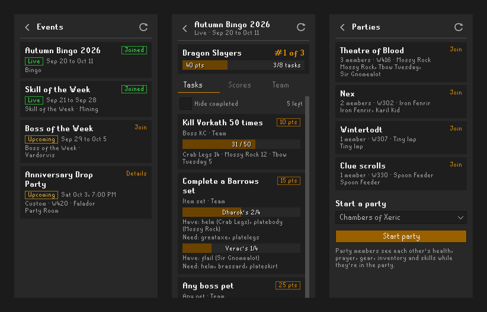
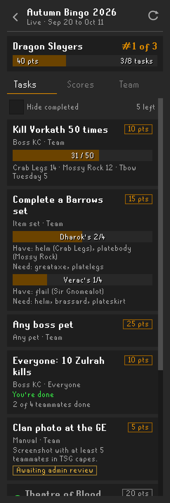
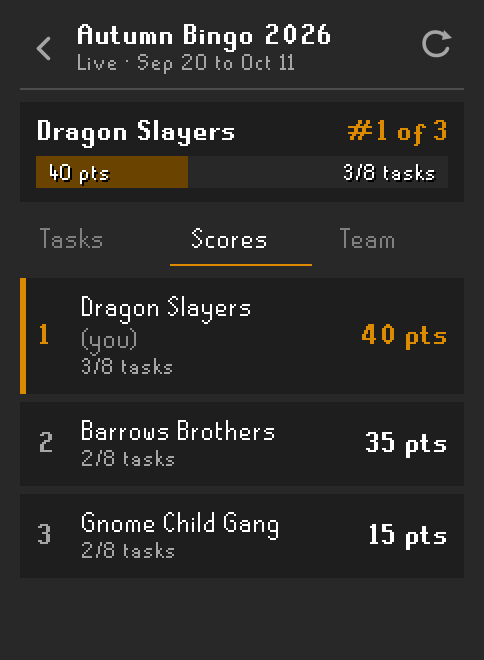
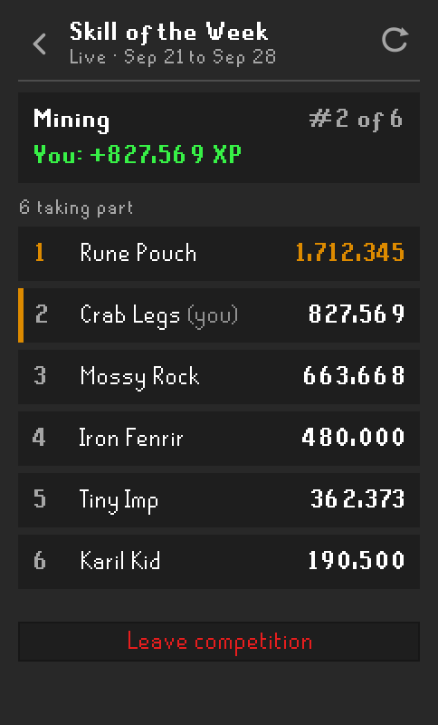
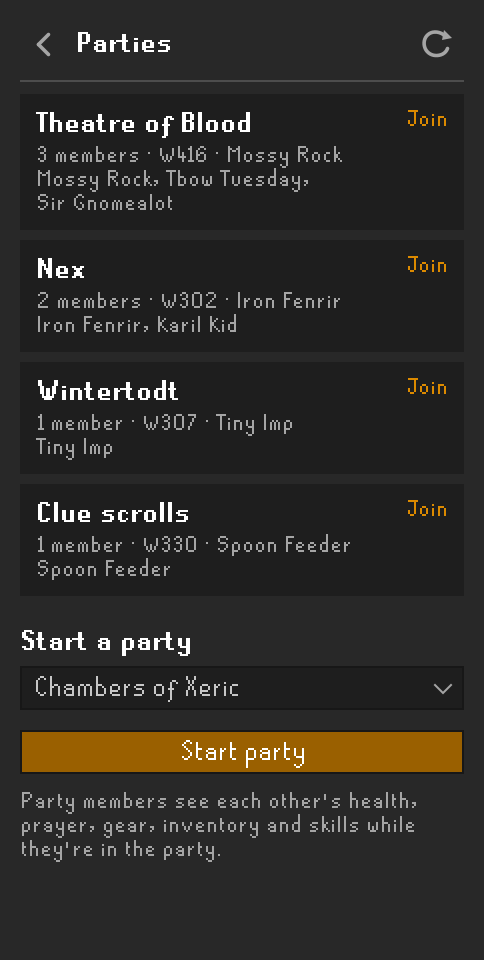
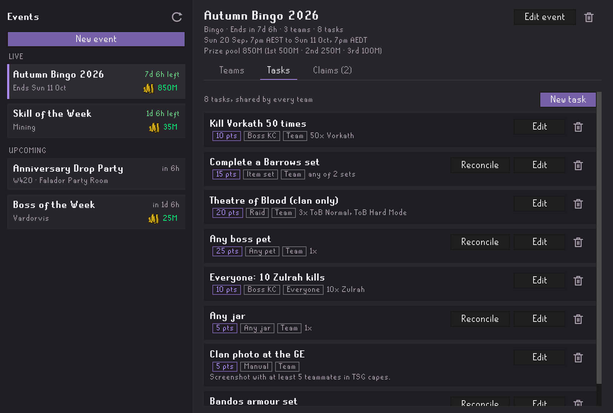
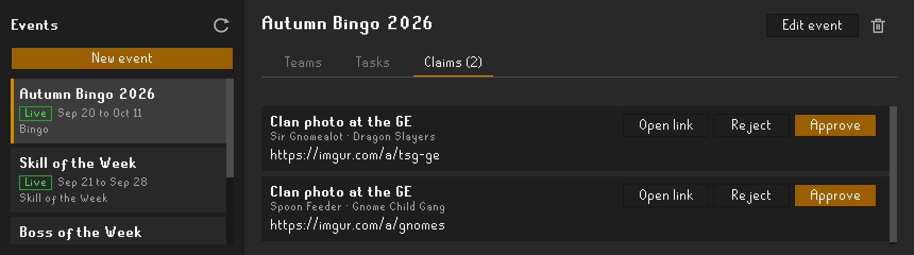

# TSG Hub

Clan events for **Type Shiii Gaming** (TSG), right in your RuneLite sidebar. Join a bingo team, climb the Skill of the Week leaderboard, find a raid party, and let the plugin track your progress while you play.

> TSG Hub only works for characters in the **TSGaming** clan. Anyone else sees a members-only message, and nothing is sent.

## Features

- **Bingo boards** with team tasks that update automatically from kills, drops, raids and collection log unlocks.
- **Skill of the Week** and **Boss of the Week** leaderboards you join with one click.
- **Custom** events (drop parties, clan trips, anything else) announced with the time, world and location.
- **Clan parties** for raids, bossing and skilling. Join with one click, no passphrase to type, and see your party's health, prayer, gear, inventory and skills live.
- **Admin tools** for Clan Administrators: create events, teams and tasks, and review proof, all without leaving the game.

## Bingo

<table>
<tr>
<td valign="top"></td>
<td valign="top">

Your team's board opens straight from the sidebar. Every task shows its points, a progress bar, and who contributed what. Open tasks sort first; tick **Hide completed** to focus on what's left.

**Scores** ranks every team, and **Team** lists your teammates. The board refreshes itself every minute while it's open.

When you make progress, a message appears in **your own chatbox only**. When your team finishes a tile, teammates who are online in clan chat get a local alert too. TSG Hub never posts to public or clan chat.

</td>
</tr>
</table>

### What gets tracked

| Task type | How it's tracked |
|---|---|
| **Boss kills** | The in-game kill count message, or loot drops for bosses without one |
| **Item drops** | Any listed item from NPC loot, matched by RuneLite item ID |
| **Item sets** | Every piece of a set, such as Barrows or Bandos. Teammates can each find different pieces |
| **Any jar / Any boss pet** | Built-in groups, so admins don't have to list every item |
| **Raids** | Chambers of Xeric, Theatre of Blood and Tombs of Amascut completions, per mode. Optionally clan-only |
| **Collection log** | New collection log unlocks count toward set tasks |
| **Manual** | Submit a screenshot link or note; an admin reviews it |

Tasks can be **Team** (everyone's progress pools together), **Everyone** (each member reaches the target), or **Solo** (one member does it alone).

## Competitions and custom events

<table>
<tr>
<td valign="top"></td>
<td valign="top">

**Skill of the Week** tracks the XP you gain in one skill. **Boss of the Week** counts kills of one boss. Click the event, press join, and play: your gain and rank update as you go.

**Custom events**, like drop parties, show when and where they happen, in your own time zone, along with the host and any notes.

</td>
</tr>
</table>

## Clan parties

<table>
<tr>
<td valign="top"></td>
<td valign="top">

The **Parties** section lists every open party in the clan, with its activity, world and members. Click one to join, or start your own: pick a raid, a group boss, a minigame, or type your own activity.

There's no passphrase to share. Once you're in, each member's panel shows their health, prayer, special attack, run energy, gear, inventory, skills and active prayers, live over RuneLite's party connection.

A party closes when its last member leaves. Members drop out after 3 minutes without checking in, or after 30 minutes at the login screen.

</td>
</tr>
</table>

## Getting started

1. Install **TSG Hub** from the Plugin Hub.
2. Log in to a character in the TSGaming clan and open the TSG Hub sidebar.
3. Click **Enable sharing**. Nothing is sent until you do.
4. Pick an event. For bingo, enter the team code an admin gave you. Your team is fixed once you join.

**Disconnect from event** on the **Team** tab stops tracking on this device. Your team keeps its progress, and you can rejoin with the same code.

## For admins

Clan Administrators and above see an admin button in the sidebar header. It opens a separate window with your clan's events on the left and the selected event on the right.

1. **New event**: pick bingo, Skill of the Week, Boss of the Week or a custom event, then set its name and dates. You can hide scores from players until the end.
2. **Teams**: add teams. Each gets a permanent invite code; use **Copy code** to share it.
3. **Tasks**: add tasks shared by every team. Item tasks have type-ahead search with icons and ready-made sets, and raid tasks let you choose each raid and mode.
4. **Claims**: approve or reject manual submissions. The tab shows how many are waiting.

You can edit a task after the event starts. Progress the service already recorded is recalculated against the new requirements. To credit something the plugin couldn't see, open a team's **Details** and use **Mark complete** with a short note.

## Privacy

TSG Hub is **opt-in**. Until you click **Enable sharing** (or turn on **Share game and clan progress** in the plugin settings), it sends nothing.

Once you opt in, it sends the following to the TSG Hub service:

- Your RuneScape display name, and the clan name and rank your client detects
- Progress for events you've joined: kill counts, drops, raid completions, collection log unlocks and skill XP
- Loot you receive while a bingo event you've joined is active, so admins can reconcile a task from earlier drops if its item list changes
- Manual proof you submit
- Whether you're currently in the clan chat channel, so teammates' completion alerts reach you

In a clan party, your stats, gear and inventory go to the other members through **RuneLite's party service**, not the TSG Hub service. The TSG Hub service only learns your display name, party and world.

Turning sharing off, or disconnecting from an event, deletes your local token and asks the service to revoke it. Progress your team already earned stays with the clan.

Clan membership, rank and progress are reported by each player's client. They're useful for convenience checks, but a modified client can fake them, so admins should double-check high-stakes results.

## Credits

The live party member panels are adapted from [Party Panel](https://github.com/TheStonedTurtle/party-panel) by TheStonedTurtle, under the BSD 2-Clause license. See [THIRD_PARTY_NOTICES.md](THIRD_PARTY_NOTICES.md).

TSG Hub is licensed under the [BSD 2-Clause License](LICENSE).
